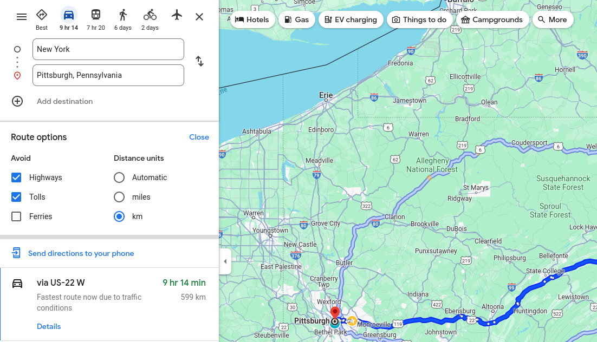

# kombii: Generate full or conditional combinatorial test cases

## 1. Understanding the problem that `kombii` tries to solve

In this section, I'm trying to help you understand the problem that `kombii` tries to solve, so you will know whether it is the tool for the problem at hand. In summary, `kombii` is mainly designed for **the testing engineers** to find the valid test cases in **combinatorial testing problems** in order to achieve 100% coverage of testing.

### 1.1 What is a "combinatorial testing problem"?

When we test a software, oftentimes we find the software behavior is determined by the combination of some options. The goal of the testing is to make sure the software behaves correctly under all the possible combinations of these options.

Take Google Maps for example. When searching for the possible routes from one place to another, Google Maps allows the users to choose their preferences. See the screenshot below:



In order to show the suggested routes, Google Maps depends on the choices for the following options:
- The category of transportation: Driving, Transit (i.e., buses/trains), Walking, Cycling, Flights. The selected category of transportation affects the available "Route options" which allow the users to further fine-tune the results.
- If "cars" is selected, Google Maps allows the users to choose if they want to avoid highways/tolls/ferries, as well as the units in which the distance is displayed.
- If "buses/trains" is selected, Google Maps allows the users to choose the type of vehicle: bus, subway, train, or "tram and light rail". It also allows the users to specify the experience such as "fewer transfers" or "less walking". This is not shown in the screenshot above. Note that these options are not available if "cars" is currently selected.

It works similarly when "walking", "bicycling" or "airplanes" is selected and I'll not talk about all of them here.

Suppose you are asked to test the route searching function of Google Maps (either as a Google engineer or as a real end user), how would you want to do a good test?

A common way of modelling this test problem is to identify the "variables" that can affect the software behavior. For example, the transportation category can be seen as such a "variable": depending on its actual value (e.g., "Driving", "Transit", "Waking"), the software behaves differently. Another variable can be the route options. For example, depending on the actual value of units (e.g., km vs miles), the route distance that's displayed on the map is also different (e.g., "599 km" vs "372 miles").

You will quickly realize that, in order to make sure Google Maps works as expected, you will need to cover all the possible combinations of the identified variables. The following table shows the beginning part of the possible combinations with five identified variables (shown in the header line):

| Transportation | Avoid   | units | Prefer | Routes |
|:--------------:|:-------:|:-----:|:------:|:------:|
| Driving        | None    | Auto  | N/A    | N/A    |
| Driving        | None    | miles | N/A    | N/A    |
| Driving        | None    | km    | N/A    | N/A    |
| Driving        | Highway (H) | Auto  | N/A    | N/A    |
| Driving        | Highway | miles | N/A    | N/A    |
| Driving        | Highway | km    | N/A    | N/A    |
| Driving        | Tolls (T)  | Auto  | N/A    | N/A    |
| Driving        | Tolls   | miles | N/A    | N/A    |
| Driving        | Tolls   | km    | N/A    | N/A    |
| Driving        | Ferries (F) | Auto  | N/A    | N/A    |
| Driving        | Ferries | miles | N/A    | N/A    |
| Driving        | Ferries | km    | N/A    | N/A    |
| Driving        | H + T   | Auto  | N/A    | N/A    |
| Driving        | H + T   | miles | N/A    | N/A    |
| Driving        | H + T   | km    | N/A    | N/A    |
| Driving        | H + F   | Auto  | N/A    | N/A    |
| Driving        | H + F   | miles | N/A    | N/A    |
| Driving        | H + F   | km    | N/A    | N/A    |
| Driving        | T + F   | Auto  | N/A    | N/A    |
| Driving        | T + F   | miles | N/A    | N/A    |
| Driving        | T + F   | km    | N/A    | N/A    |
| Driving        | H + T + F   | Auto  | N/A    | N/A    |
| Driving        | H + T + F   | miles | N/A    | N/A    |
| Driving        | H + T + F   | km    | N/A    | N/A    |
| Transit        | N/A     | N/A   | Bus    | Best route |
| Transit        | N/A     | N/A   | Bus    | Fewer transfers |
| Transit        | N/A     | N/A   | Bus    | Less walking |
| Transit        | N/A     | N/A   | Bus    | Wheelchair accessible |
| ...            |
| ...            |

You can also notice that not all "route options" are available under a certain transportation. For example, "Prefer" is not available when "Driving" is selected. Similarly, "Avoid" is not available when "Transit" is selected. Therefore, the following two example combinations are not valid:

| Transportation | Avoid   | units | Prefer | Routes       |
|:--------------:|:-------:|:-----:|:------:|:------------:|
| Driving        | None    | Auto  | Bus    | Best route   |
| Transit        | Tolls   | miles | Train  | Less walking |

Note that there is no single way to model a test problem. For example, in the table above, I put all the variable together. Some people may prefer to further divide the original test problem into smaller one, with each transportation category as a sub-problem, so they don't need to deal with those annoying "N/A" values. This divide-and-conquer-based model surely works too.

## How to use

See [examples/ipv4_ipv6.py](./examples/ipv4_ipv6.py) which implements the constraints in the "Background" section.

To run it, `cd` into `examples` and run `PYTHONPATH="../src" python3 -m ipv4_ipv6`, and it prints all the valid test cases (12 in total) under the given constraints:

```
1: {'v4_enabled': False, 'v6_enabled': False, 'v4_ip': 'N/A', 'v4_dns': 'N/A', 'v6_ip': 'N/A', 'v6_dns': 'N/A'}
2: {'v4_enabled': False, 'v6_enabled': True, 'v4_ip': 'N/A', 'v4_dns': 'N/A', 'v6_ip': 'Auto', 'v6_dns': 'Auto'}
3: {'v4_enabled': False, 'v6_enabled': True, 'v4_ip': 'N/A', 'v4_dns': 'N/A', 'v6_ip': 'Auto', 'v6_dns': 'Manual'}
4: {'v4_enabled': False, 'v6_enabled': True, 'v4_ip': 'N/A', 'v4_dns': 'N/A', 'v6_ip': 'Manual', 'v6_dns': 'Manual'}
5: {'v4_enabled': True, 'v6_enabled': False, 'v4_ip': 'Auto', 'v4_dns': 'Auto', 'v6_ip': 'N/A', 'v6_dns': 'N/A'}
6: {'v4_enabled': True, 'v6_enabled': False, 'v4_ip': 'Auto', 'v4_dns': 'Manual', 'v6_ip': 'N/A', 'v6_dns': 'N/A'}
7: {'v4_enabled': True, 'v6_enabled': False, 'v4_ip': 'Manual', 'v4_dns': 'Manual', 'v6_ip': 'N/A', 'v6_dns': 'N/A'}
8: {'v4_enabled': True, 'v6_enabled': True, 'v4_ip': 'Auto', 'v4_dns': 'Auto', 'v6_ip': 'Auto', 'v6_dns': 'Auto'}
9: {'v4_enabled': True, 'v6_enabled': True, 'v4_ip': 'Auto', 'v4_dns': 'Manual', 'v6_ip': 'Auto', 'v6_dns': 'Manual'}
10: {'v4_enabled': True, 'v6_enabled': True, 'v4_ip': 'Auto', 'v4_dns': 'Manual', 'v6_ip': 'Manual', 'v6_dns': 'Manual'}
11: {'v4_enabled': True, 'v6_enabled': True, 'v4_ip': 'Manual', 'v4_dns': 'Manual', 'v6_ip': 'Auto', 'v6_dns': 'Manual'}
12: {'v4_enabled': True, 'v6_enabled': True, 'v4_ip': 'Manual', 'v4_dns': 'Manual', 'v6_ip': 'Manual', 'v6_dns': 'Manual'}
```
